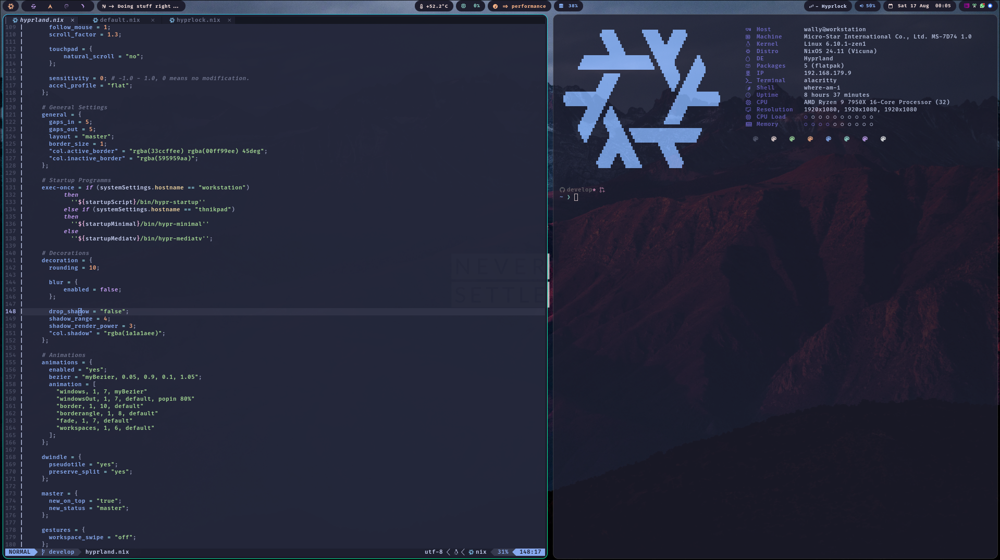

# Wally's Nix-Configs

 

## Table of Content:

- [Description](#description)
- [Installation](/INSTALL.md)
- [Repo Structure](#repository-structure)
- [User Space Documentation](user/README.md)
    - [Hyprland](/user/wayland/README.md)
    - [Qtile](/user/x11/README.md)
    - [Applications](/user/apps/README.md)
    - [cli](/user/cli/README.md)
    - [nixvim](/user/cli/nvim/README.md)
- [System Space Documentation](system/README.md)


## Description

This Repository should serve as a starting / inspiration point for people intrested in the world of Nix / NixOS...

98% Declarative, last 2% are:
    - VM's Configs
    - Container Configs
    - Browser extensions Keybindings & Configs


### Repository Structure

```bash
.
├── flake.nix               # Starting Point of the Repo
├── README.md               # Documentation
├── system                  # System Space
│  ├── helper                   # Various Modules to import
│  ├── mediatv                  # MediaTV hardware-configurations
│  ├── mediatv.nix              # MediaTV configurations
│  ├── system.md                # System Space Documentation
│  ├── thinkpad                 # Thinkpad hardware-configurations
│  ├── thinkpad.nix             # Thinkpad configurations
│  ├── workstation              # Various Workstation hardware-configurations
│  └── workstation.nix          # Workstation configurations
└── user                    # User Sapce
   ├── apps                     # Gui Apps (X11 & Wayland) installs / configs
   ├── cli                      # All about the cli (tools & configs)
   ├── home.nix                 # Home-manager configs
   ├── theme.nix                # GTK / QT Themeing...
   ├── user.md                  # User Space Documentation
   ├── wallpapers               # Used wallpapers
   ├── wayland                  # Hyprland Ecosystem
   ├── wsl.nix                  # Wsl home-manager Module
   └── x11                      # Qtile (X11) Ecosystem
```

---

## Features

- Reproduceble definition of Environment, WindowManager & Apps
    - Code once deploy everywhere
    - Declarative Ricing :)

- Hyprland & Ecosystem declarativly in `Nix`

- Qtile (x11) as backup WindowManager

- Virtualization tools
    - VM's: libvirtd, virt-manager, virt-viewer ...
    - Pod's: podman, distrobox, kubectl ...

- *VFIO* Ready! Boot/Grub example of a GPU Passthrough [boot / grub](system/workstation/boot.nix)

- [websearch](user/cli/scripts/websearch.nix) => Rofi / Fuzzel script for quick Websearch

- [virt-run](user/cli/scripts/virt_run.nix) => Rofi / Fuzzel script to quick attach to VM's or distrobox Containers


## TODO's:

    - Finish Documentation
    - Build StudioPC
    - Learn about Profiles


---

## Special Thanks

(In no particular Order...)

- LibrePhoenix:     [Github](https://github.com/librephoenix/nixos-config)
- Vimjoyer:         [Github](https://github.com/vimjoyer)
- Titus tech:       [Github](https://github.com/ChrisTitusTech)
- Distrotube:       [Gitlab](https://gitlab.com/dwt1)

---

## Usefull links / docs:

 - https://github.com/lutris/docs/blob/master/InstallingDrivers.md
 - https://nixos.wiki/wiki/AMD_GPU


 


----
